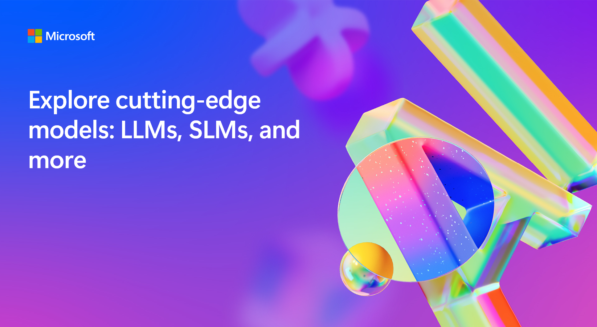

# BRK453 Exploring cutting-edge models: LLMs, SLMs, local development and more

## Session Desciption
Today, there are many Generative AI models to choose from: Large Language Models (LLMs), Small Language Models (SLMs), proprietary models, open models, models in the cloud, models on devices, text models, code models, image models, and multimodal models. In this session, we'll provide guidance to help you choose the right model to fit your needs, and tools you can use to evaluate and compare models for your specific tasks.

### Breakout Abstract:
There are many Generative AI models: LLMs, SLMs, proprietary, open, cloud-based, on-device, text, code, image, and multimodal. Learn how to choose the right model for your needs and about tools to evaluate and compare models for specific tasks.
 
### Duration: 
45 minutes

## Learning Outcomes
 
### Understanding of Generative AI Models:
Attendees should leave with a clear understanding of what generative AI models are, how they work, and their significance in various applications.
### Model Selection Criteria:
Participants will learn how to choose the right model for specific tasks based on factors such as task requirements, model capabilities, and performance metrics.
### Awareness of Model Types:
We’ll explore different types of generative models, including Large Language Models (LLMs) like GPT-3, Small Language Models (SLMs), and multimodal models that handle text, code, and images.
### Fine-Tuning Techniques:
Attendees will see how fine-tuning can improve model performance and adapt it to specific use cases.
### Evaluation and Comparison Tools:
We’ll discuss industry-standard evaluation metrics and tools like Azure AI Studio for accurate model measurement.
### Real-World Case Studies:
Examples of successful model applications will provide insights into practical deployment scenarios.
### The Future of Generative AI:
We’ll wrap up with thoughts on where this field is headed and its potential impact.

## Technology Used
- LLMs, SLMs 
- AI Studio, Azure Model Catalog, GitHub Model Catalog 
- LLMs - GPT 3.5 GPT 4/4v/4o
- SLMs - Phi-3 
- ONNX/OLIVE
- Windows AI PC SDK 

## Session Overview

### Introduction (5 min)
- Brief overview of Generative AI models
- Importance of choosing the right model for specific tasks
- DEMO- Multimodal and GPT Prompts vs DALL-E Outcomes 

### Types of Generative AI Models (8min)
- Large Language Models (LLMs)
- Small Language Models (SLMs)
- Proprietary vs. Open Models
- Cloud-based vs. On-device Models
- Text, Code, Image, and Multimodal Models
- [**DEMO- Inference Phi-3-mini-instruct & Phi-3-vision** (CopilotPC , iPhone) (2 min)](/src/README.md)

### Criteria for Choosing the Right Model (10 min)
- Task requirements and model capabilities
- Performance metrics and evaluation methods
- Iterative refinement and validation processes
- Fine-tuning options for model improvement
- [**DEMO - Phi-3 Fine-tuning** (5 min)](/src/README.md)

### Tools for Model Evaluation and Comparison ( 5-8 min)
- Azure Machine Learning for model accuracy measurement
- Industry-standard evaluation metrics for different model types
- Experimentation and validation techniques for model selection

### Case Studies (8-10 min)
- Examples of successful model applications
- Lessons learned from model deployment and usage
- [**DEMO - Phi-3 RAG** (5 min)](/src/README.md)

### Conclusion (3 min)
- Recap of key points
- Final thoughts on the future of Generative AI models

### Q&A (5min)
- Open floor for questions and discussion

## Session Resources and Continued Learning

| Resources          | Links                             | Description        |
|:-------------------|:----------------------------------|:-------------------|
| Phi-3 CookBook  | [Phi-3CookBook](https://aka.ms/phi-3cookbook) | Learn more about Phi-3 samples, models and deployments |
| Windows AI PC and Copilot SDK  | [Windows Copilot SDK](https://aka.ms/wcr) | Use powerful AI APIs with Windows Copilot Library|
| ONNX Runtime  | [ONNXRuntime](https://onnxruntime.ai/) | Accelerated Mobile Machine Learning Production-grade AI engine to speed up training and inferencing in your existing technology stack.|
| AI Studio Model Catalog  | [AI Studio Model Catalog](https://ai.azure.com/explore/models) | Find the right model to build your custom AI solution|
| GitHub Model Catalog | [GitHub Model Catalog](https://github.com/marketplace/models) | Models Try, test, and deploy from a wide range of model types, sizes, and specializations.|

## Evaluating AI Models with Benchmarks and Azure AI Tools

| Benchmarks          | Description                                                                                                                                                            | Reference URL                                                                        |
| ------------------- | ---------------------------------------------------------------------------------------------------------------------------------------------------------------------- | ------------------------------------------------------------------------------------ |
| GLUE Benchmark      | GLUE (General Language Understanding Evaluation) benchmark provides a standardized set of diverse NLP tasks to evaluate the effectiveness of different language models | [https://gluebenchmark.com/](https://gluebenchmark.com/)                             |
| SuperGLUE Benchmark | Compares more challenging and diverse tasks with GLUE, with comprehensive human baselines                                                                              | [https://super.gluebenchmark.com/](https://super.gluebenchmark.com/)                 |
| HellaSwag           | Evaluates how well an LLM can complete a sentence                                                                                                                      | [https://rowanzellers.com/hellaswag/](https://rowanzellers.com/hellaswag/)           |
| TruthfulQA          | Measures truthfulness of model responses                                                                                                                               | [https://github.com/sylinrl/TruthfulQA](https://github.com/sylinrl/TruthfulQA)       |
| MMLU                | MMLU ((Massive Multitask Language Understanding) evaluates how well the LLM can multitask                                                                              | [https://github.com/hendrycks/test](https://github.com/hendrycks/test)               |
| KILT                | Library for Knowledge intestive language tasks                                                                                                                         | [https://github.com/facebookresearch/KILT](https://github.com/facebookresearch/KILT) |

## Frameworks 

| Frameworks / Platforms                 | Description                                                                                                                                                                                                                                                    | Tutorials/lessons                                                                                                                            | Reference                                       |
| -------------------------------------- | -------------------------------------------------------------------------------------------------------------------------------------------------------------------------------------------------------------------------------------------------------------- | -------------------------------------------------------------------------------------------------------------------------------------------- | ----------------------------------------------- |
| Azure AI Studio Evaluation (Microsoft) | Azure AI Studio is an all-in-one AI platform for building, evaluating, and deploying generative AI solutions and custom copilots.Technical Landscape: No code: model catalog in AzureML studio & AI studio, Low-code: as CLI, Pro-code: as azureml-metrics SDK | [Tutorials](https://learn.microsoft.com/en-us/azure/ai-studio/concepts/evaluation-approach-gen-ai)                                           | [Link](https://ai.azure.com/)                   |
| Prompt Flow (Microsoft)                | A suite of development tools designed to streamline the end-to-end development cycle of LLM-based AI applications, from ideation, prototyping, testing, and evaluation to production, deployment, and monitoring.                                              | [Tutorials](https://microsoft.github.io/promptflow/how-to-guides/quick-start.html)                                                           | [Link](https://github.com/microsoft/promptflow) |
| Weights & Biases(Weights & Biases)     | A Machine Learning platform to quickly track experiments, version and iterate on datasets, evaluate model performance, reproduce models, visualize results and spot regressions, and share findings with colleagues.                                           | [Tutorias](https://docs.wandb.ai/tutorials),   [DeepLearning.AI Lesson](https://learn.deeplearning.ai/evaluating-debugging-generative-ai) | [Link](https://docs.wandb.ai/)                  |

## Content Owners

<!-- ALL-CONTRIBUTORS-LIST:START - Do not remove or modify this section -->

<table>
<tr>
    <td align="center"><a href="http://learnanalytics.microsoft.com">
         
        <b>Lee Stott
</b></a> 
            <a href="https://github.com/leestott" title="talk">📢</a> 
    </td>
   <td align="center"><a href="http://learnanalytics.microsoft.com">
         
        <b>Kinfey Lo
</b></a> 
            <a href="https://github.com/kinfey" title="talk">📢</a> 
    </td>
     
</tr></table>

<!-- ALL-CONTRIBUTORS-LIST:END -->

