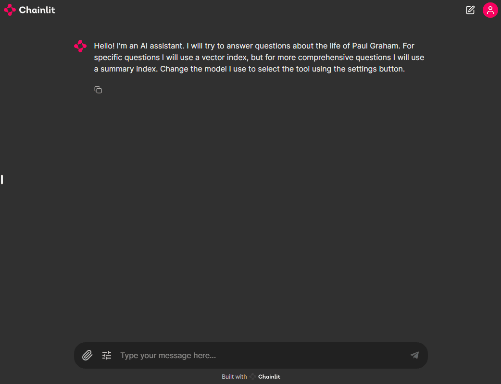

# GitHub Model Catalog and Choosing the right LLM Model

In this repository, you will learn how you can use models deployed in [GitHub MarketPlaces Model](https://github.com/marketplace/models) to use the best model for the right job and consume the greatest innovation.

## Using GitHub Models (Maas) 

We are using Github Models as Service to deploy the required models. The environment supports a dedicated codespace and you can interact with the following Serverless API endpoints. 

The following models are available in the GitHub Models service with new models expected so please check the [GitHub Marketplace Models](https://github.com/marketplace/models) for additional models:

**AI21 Labs:** 
- AI21-Jamba-Instruct

**Cohere:** 
- Cohere-command-r
- Cohere-command-r-plus

**Meta:** 
- Meta-Llama-3-70B-Instruct
- Meta-Llama-3-8B-Instruct
- Meta-Llama-3.1-405B-Instruct
- Meta-Llama-3.1-70B-Instruct 
- Meta-Llama-3.1-8B-Instruct

**Mistral AI:** 
- Mistral-large 
- Mistral-large-2407 
- Mistral-Nemo
- Mistral-small

**Azure OpenAI:** 
- gpt-4o
- gpt-4o-mini

**Microsoft** 
- Phi-3-medium-128k-instruct 
- Phi-3-medium-4k-instruct 
- Phi-3-mini-128k-instruct 
- Phi-3-mini-4k-instruct
- Phi-3-small-128k-instruct
- Phi-3-small-8k-instruct
- Phi-3.5-mini-instruct

## Environment setup

### GitHub Codespaces

You can run this samples virtually by using GitHub Codespaces and no additional settings or setup are required. 

1. To run chainlit demo app, run the following command in the Codespace Terminal Window:

```bash
source .env
cd src/01.InferencePhi3/03.ChainlitApp
chainlit run app.py -w
```
A browser will open in `http://localhost:8000`.

See Running Demo details below for more details

### Running Locally using VS Code Dev Containers

⚠️ This option will only work if your Docker Desktop is allocated at least 16 GB of RAM. If you have less than 16 GB of RAM, you can try the [GitHub Codespaces option](#github-codespaces) or [set it up locally](#local-environment).

A related option is VS Code Dev Containers, which will open the project in your local VS Code using the [Dev Containers extension](https://marketplace.visualstudio.com/items?itemName=ms-vscode-remote.remote-containers):

1. Start Docker Desktop (install it if not already installed)
2. Open the project:
3. In the VS Code window that opens, once the project files show up (this may take several minutes), open a terminal window.
4. Setting your GitHub Personal Token to autenticate (Only Required for Local deploymants, NO additional steps are required if your running **GitHub Codespaces**)
5.  Create a personal access token
You do not need to give any permissions to the token. Note that the token will be sent to a Microsoft service.

Create a [GitHub Personal Token](https://github.com/settings/tokens)

To use the code snippets below, create an environment variable to set your token as the key for the client code.

If you're using bash:

```
export GITHUB_TOKEN="<your-github-token-goes-here>"
```

If you're in powershell:
```
$Env:GITHUB_TOKEN="<your-github-token-goes-here>"
```

If you're using Windows command prompt:

```
set GITHUB_TOKEN=<your-github-token-goes-here>
```
6. Run the Demo 

To run chainlit demo app, run the following command from your VScode terminal window:

```bash
source .env
cd src/01.InferencePhi3/03.ChainlitApp
chainlit run app.py -w
```
A browser will open in `http://localhost:8000`.

See Running Demo details below for more details

### The Sample Notebooks and Demo
This example currently build the packages `llama-index-embeddings-azure-inference` and `llama-index-llms-azure-inference` from source in LlamaIndex.

This repository has the following examples:

* [llama_index_selector.ipynb](llama_index_selector_gh_models.ipynb): It explains how multiple LLMs can be use for data generation, evaluation, and for specific tasks like tool selection. It shows how to instrument your code using Phoenix.
* [app.py](app.py): A chainlit project that allows you to play with index we built in the previous example. Use the notebook to learn about the technique and the approach. You can use this playground for testing the idea.

## Running the Web App Demo 

## LLM Model Evaluation and routing

LLM stands for Large Language Model. These are AI models trained on extensive text data to understand and generate human-like text.

### The LLM Used for Generation
This refers to the specific LLM that was used to generate the text or response you’re seeing. In this case, Simply select the model you wish to use to use and quickly and easily compare the output based on the model.

### Router LLM:
A Router LLM is used to determine which specific LLM should handle a given request. It routes the request to the most appropriate model based on the input.

**Selecting the Models**
Choose the setting button on the chat window and simply select the required models.

**For example:** 
- Select, Mistral-small as the router, means Mistral-Small will decides how to handle the request and directs it to the model for generation.
- Select, Phi-3-medium-128k-instruct  as the LLM Generation, means Phi-3-medium-128k-instruct will decide how to format the out to the chat window.

### Running the Demo
To run chainlit demo app, run the following command:

```bash
source .env
cd src/01.InferencePhi3/03.ChainlitApp
chainlit run app.py -w
```

A browser will open in `http://localhost:8000`.


