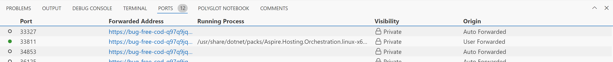

# Demo-03 : Cloud Native RAG Solutions with Phi-3

## Getting Started with Phi-3 and .NET Aspire

### Navigate to the Project Directory:
```
cd src/03.CloudNativeRAG/Phi3DotNETAspire/Phi3.Aspire.AppHost
```

### Build the Project:

```
dotnet build
```

### Copy Necessary Libraries:

Ensure you are in the .../src/03.CloudNativeRAG/Phi3DotNETAspire/Phi3.Aspire.AppHost folder

```

cp ../../libs/onnxruntime-genai/build/Linux/RelWithDebInfo/libonnxruntime-genai.so ../Phi3.Aspire.ModelService/bin/Debug/net8.0/runtimes/linux-x64/native

cp ../../libs/onnxruntime-genai/build/Linux/RelWithDebInfo/libonnxruntime.so ../Phi3.Aspire.ModelService/bin/Debug/net8.0/runtimes/linux-x64/native

cp ../../libs/onnxruntime-genai/build/Linux/RelWithDebInfo/libonnxruntime.so.1 ../Phi3.Aspire.ModelService/bin/Debug/net8.0/runtimes/linux-x64/native

cp ../../libs/onnxruntime-genai/build/Linux/RelWithDebInfo/libonnxruntime.so.1.20.0 ../Phi3.Aspire.ModelService/bin/Debug/net8.0/runtimes/linux-x64/native

```

### Set Environment Variable:
```
export ASPIRE_ALLOW_UNSECURED_TRANSPORT=true
```

### Run the Application:
```
dotnet run --launch-profile http
```

### Accessing the .NET Aspire Portal
Click the Follow Link in the terminal to open the .NET Aspire Portal: 

Eample of the follow link in the info section of the output in your terminal 
```
Login to the dashboard at http://localhost:15147/login?t=65d752d2a8345d9f3t5656ef78e4777
```


### Enter the token

You will be prompted to enter a login token this can be found in your terminal output.

Example will be as follows
```
Login to the dashboard at http://localhost:15147/login?t=65d752d2a8345d9f3t5656ef78e4777
```

In this case the login code is 
```
65d752d2a8345d9f3f10680ef78e4777
```

### View the Portal:
Setting Up Vue Portal in Codespaces
Open up the brower windows and you will see the .NET Aspire Portal with a list of services and ports, select the vue services. You will see Endpoint as per the example below http://localhost:42811, copy port number 42811


### Configure Your Ports: 
You know need to configure your GitHub Codespaces ports. 
To set up port forwarding for http://localhost:42811 in GitHub Codespaces, follow these steps:


**Access the PORTS tab:**

- If you’re using Visual Studio Code, click on the PORTS tab in the bottom panel.
- If you’re using the browser, you can find the PORTS tab in terminal window.

**Add the port:**

You can manually forward a port that wasn't forwarded automatically.

- Open the terminal in your codespace.
- Click the PORTS tab.

Under the list of ports, click Add port.
- Click on Add port.
- Enter 42811 as the port number and press Enter.

**Access the forwarded port:**

Once the port is forwarded, you can access it via a URL provided by GitHub Codespaces. This URL will be displayed in the PORTS tab and can be clicked to open in your browser.

**Change port protocol:**

If you need to use HTTPS instead of HTTP, right-click the port in the PORTS tab, hover over Change Port Protocol, and select HTTPS.
For more detailed information, you can refer to the GitHub Docs on forwarding ports in [Codespaces](https://docs.github.com/en/codespaces/developing-in-a-codespace/forwarding-ports-in-your-codespace)

### Chat with Phi-3

**Start Chatting:** 

- You need to open the newly created port 

- In the terminal select the newly created port forwarding address and select open browser


You can now start to chat

