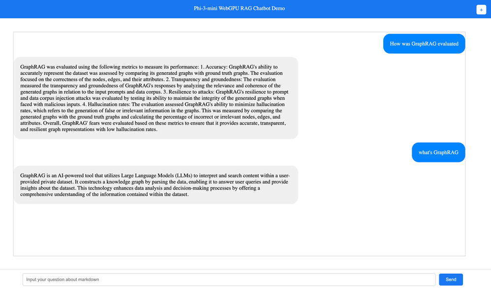

# Source code

This is the Sample Code for AI Tour Session - Exploring Cutting Edge Models


***Note:*** You need to wait for Codespaces to initialize, because the model needs to be downloaded.


## Lab-01 : Inference Phi-3 ONNX

This is about scenarios that reference, iOS apps, and RAG(WebGPU) with Phi-3-Instruct and Phi-3-Vision 

| <div style="width:280px">Resources</div>          | <div style="width:180px">Links</div>                           | Description |
|-------------------|----------------------------------|-------------------|
| 01. Introduce Phi-3  | [01.Phi-3 Instruct](../src/01.InferencePhi3/01.notebooks/01.Phi3_Instruct.ipynb) <br/><br/> [02.Phi-3 Vision](../src/01.InferencePhi3/01.notebooks/02.Phi3_Vision.ipynb) <br/><br/> [03.Phi-3 vs GPT-4o](../src/01.InferencePhi3/01.notebooks/03.GPT4o_Vision.ipynb) | Introduce Phi-3,including instruct and vision samples. We can compare the generation result with Phi-3 Vision and GPT-4o  |
| 02. Using iPhone to create copilot application    | [Code](../src/01.InferencePhi3/02.ios/) | Create iPhone chat apps witn Phi-3 mini |
| 03. Create RAG App with WebGPU   | [Code](../src/01.InferencePhi3/03.chat/) | Create RAG app with WebGPU |


### ***01.notebooks***

01.Phi3_Instruct.ipynb & 02.Phi3_Vision.ipynb 

just running

03.GPT4o_Vision 

You need to have Azure OpenAI Service Subscription or GitHub Models

We can compare the results of Phi-3-Vision and GPT-4o, and you will find that Phi-3-Vision also has very strong code and image understanding capabilities.


### ***02.iOS***

Use macOS to build this sample

### ***03.WebGPU***


***Required environment***

- Support Google Chrome 113+, Microsoft Edge 113+, Safari 18 (macOS 15), Firefox Nightly

- Enable WebGPU

    Perform the following operations in the Chrome / Microsoft Edge address bar

    The chrome://flags/#enable-unsafe-webgpu flag must be enabled (not enable-webgpu-developer-features). Linux experimental support also requires launching the browser with --enable-features=Vulkan.

- Safari 18 (macOS 15) is enabled by default

- Firefox Nightly Enter about:config in the address bar and set dom.webgpu.enabled to true

```bash

npm run build

npm run dev

```




***Note*** 

1. We need to cache Model in Browser, so it will take some time to load model in web cache

2. Upload the markdown file [intro_rag.md](../src/01.InferencePhi3/docs/intro_rag.md) to finish RAG solution


## Lab-02 : Fine-tuning Phi-3 with AI Tools VSCode Extensions

Using AI Tools VSCode Extensions with Phi-3,including fine-tuning, inference,and deployment(Azure Machine Learing,Azure Container Apps)

[Sample Code](./02.AIToolsSolutionE2E/)

***Note*** I will update script soon


## Lab-03 : Cloud Native RAG Solutions with Phi-3

Uisng Cloud Native Solutions with Phi-3, including .NET Aspire, Semantic Kernel and RAG

[Sample Code](./03.CloudNativeRAG/)


```bash

cd Phi3DotNETAspire/Phi3.Aspire.AppHost

dotnet build

cp -r ../../libs/* ./Phi3DotNETAspire/Phi3.Aspire.ModelService/bin/Debug/net8.0/runtimes/linux-x64/native

export ASPIRE_ALLOW_UNSECURED_TRANSPORT=true 

dotnet run --launch-profile http

```

click this link to go to .NET Aspire Portal


You will see the .NET Aspire Portal


please set vue portal in your codespaces ports


Ok! You can chat with Phi-3 


