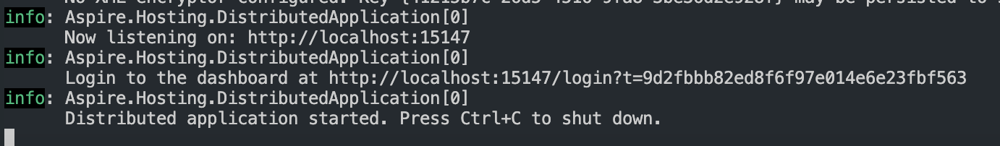
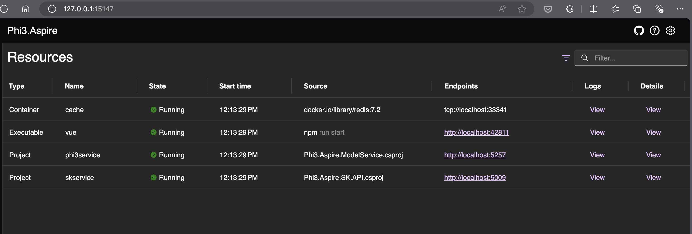
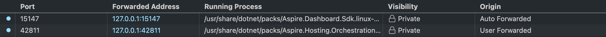
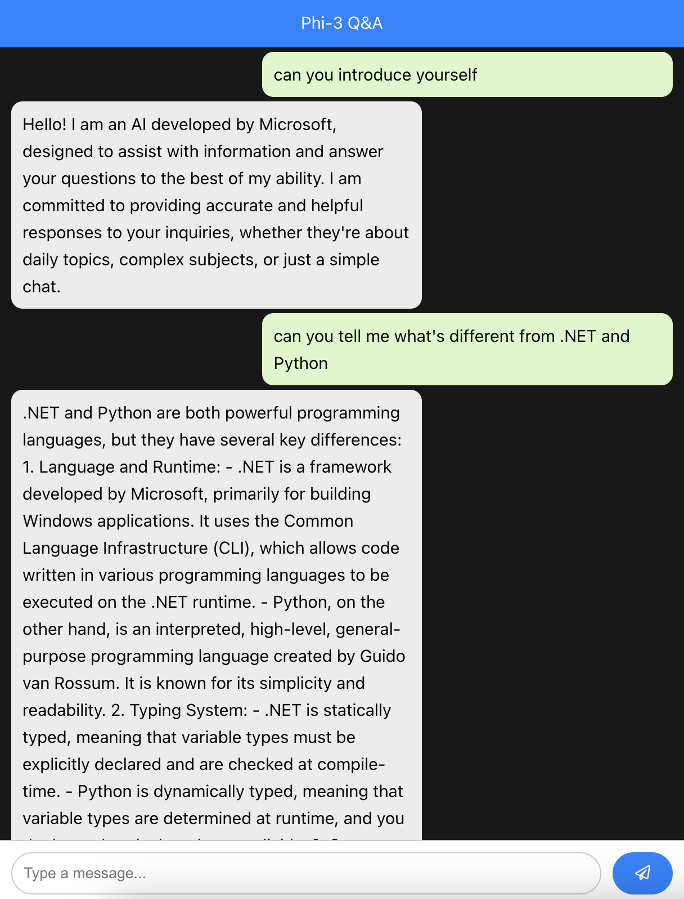

# Getting Started with Demo Source Code

## Overview of Demos
This repository contains sample code for the AI Tour Session - Exploring Cutting Edge Models. Each demo folder has a README file with more details. Additional demo videos will be available for use in PowerPoint presentations if live demos are not possible.

## Setting Up the Environment Using Codespaces
We have provided a complete Codespaces environment in the repository. You can also download the devcontainer for local installation by clicking on the devcontainer link.

### Codespace Environment:

- 32 Core CPU
- 128GB of Memory

**Note:** Please wait for Codespaces to initialize and for the setup scripts to complete. We are downloading and installing LLM and SLM models directly to Codespaces, so it may take some time.

## Demo-01: Inference with Phi-3 ONNX
This demo covers scenarios involving iOS apps and RAG (WebGPU) with Phi-3-Instruct and Phi-3-Vision.

| <div style="width:280px">Resources</div>          | <div style="width:180px">Links</div>                           | Description |
|-------------------|----------------------------------|-------------------|
| 01. Introduce Phi-3  | [01.Phi-3 Instruct](../src/01.InferencePhi3/01.notebooks/01.Phi3_Instruct.ipynb) <br/><br/> [02.Phi-3 Vision](../src/01.InferencePhi3/01.notebooks/02.Phi3_Vision.ipynb) <br/><br/> [03.Phi-3 vs GPT-4o](../src/01.InferencePhi3/01.notebooks/03.GPT4o_Vision.ipynb) | Introduce Phi-3,including instruct and vision samples. We can compare the generation result with Phi-3 Vision and GPT-4o  |
| 02. Using iPhone to create copilot application    | [Code](../src/01.InferencePhi3/02.ios/) | Create iPhone chat apps witn Phi-3 mini |
| 03. Create RAG App with WebGPU   | [Code](../src/01.InferencePhi3/03.chat/) | Create RAG app with WebGPU |


## Demo 1. Notebooks Demos for Phi-3 and GPT4o

## 01. Notebooks comparing models
`01.Phi3_Instruct.ipynb` & `02.Phi3_Vision.ipynb`: Just run these notebooks.
`03.GPT4o_Vision:` Requires an Azure OpenAI Service Subscription or GitHub Models. Compare the results of Phi-3-Vision and GPT-4o to see Phi-3-Vision’s strong code and image understanding capabilities.

### 02.iOS
Use macOS to build this sample.

### 03.WebGPU
Required Environment:

**Supported browsers:** 
- Google Chrome 113+
- Microsoft Edge 113+
- Safari 18 (macOS 15)
- Firefox Nightly.

### Enable WebGPU:
- In Chrome/Microsoft Edge, enable the `chrome://flags/#enable-unsafe-webgpu` flag.
- For Linux, launch the browser with `--enable-features=Vulkan`.
- Safari 18 (macOS 15) has WebGPU enabled by default.
- In Firefox Nightly, enter about:config in the address bar and `set dom.webgpu.enabled to true`.

Run the following command to get strated 
```
npm run build
```
```
npm run dev
```

### WebGPU Demo

**Note:** The model needs to be cached in the browser, so it may take some time to load. Upload the markdown file `intro_rag.md` to complete the RAG solution.

## Demo-02 : Fine-tuning Phi-3 with AI Tools VSCode Extensions

Using AI Tools VSCode Extensions with Phi-3,including fine-tuning, inference,and deployment(Azure Machine Learing,Azure Container Apps)

[Sample Code](./02.AIToolsSolutionE2E/)

***Note*** I will update script soon


## Demo-03 : Cloud Native RAG Solutions with Phi-3

Using Cloud Native Solutions with Phi-3, including .NET Aspire, Semantic Kernel and RAG

[Sample Code](./03.CloudNativeRAG/)


```bash

cd Phi3DotNETAspire/Phi3.Aspire.AppHost

dotnet build

cp -r ../../libs/* ./Phi3DotNETAspire/Phi3.Aspire.ModelService/bin/Debug/net8.0/runtimes/linux-x64/native

export ASPIRE_ALLOW_UNSECURED_TRANSPORT=true 

dotnet run --launch-profile http

```

click this link to go to .NET Aspire Portal



You will see the .NET Aspire Portal



please set vue portal in your codespaces ports



Ok! You can chat with Phi-3 





